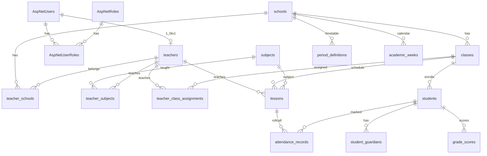

# SQL Server + EF Core Code First — Student Management

## Auth: ASP.NET Identity — có phù hợp?

**Có — nên dùng.** Hệ thống cần đăng nhập email/password, role Admin/Teacher, hash mật khẩu, JWT/cookie — đúng bài Identity giải quyết. Không nên tự viết bảng `Users` + `PasswordHash`.

| Phần                             | Dùng Identity                     | Giữ domain entity riêng                      |
| -------------------------------- | --------------------------------- | -------------------------------------------- |
| Login, password, lockout, claims | `ApplicationUser`, `IdentityRole` | —                                            |
| Role Admin / Teacher             | `AspNetRoles` + `AspNetUserRoles` | —                                            |
| Hồ sơ GV, phone, môn chính       | —                                 | `Teacher` (1:0..1 với user)                  |
| Gán trường / lớp / môn           | —                                 | `TeacherSchool`, `TeacherClassAssignment`, … |
| Học sinh, lịch, điểm danh, điểm  | —                                 | Domain tables                                |

**Cách gắn:**

- `ApplicationUser : IdentityUser` (PK **string** mặc định) — thêm `AccountNo`, `FullName`, `Status`
- `Id` = mã 10 ký tự (`0000000001`), **không** dùng Guid
- `UserName` = `Email` (FE login email)
- Role qua `UserManager.AddToRoleAsync` / `[Authorize(Roles = "Admin")]`
- Admin: chỉ `ApplicationUser` + role Admin
- Teacher: `ApplicationUser` + role Teacher + `Teacher` (`UserId` FK string)

**Không nhét vào IdentityUser:** `SchoolIds`, `TaughtClassIds`, homeroom.

---

## Stack & quy ước

| Mục                | Lựa chọn                                                                     |
| ------------------ | ---------------------------------------------------------------------------- |
| DB                 | **SQL Server**                                                               |
| ORM                | **EF Core Code First** + Migration                                           |
| Auth               | **ASP.NET Core Identity** (`IdentityUser` / `IdentityRole` — key **string**) |
| PK / FK            | `string` độ dài **10**, dạng số zero-pad: `0000000001` … `9999999999`        |
| Subject (ngoại lệ) | slug FE: `math`, `physics`, … (không sequential)                             |
| Chuỗi khác         | `nvarchar`                                                                   |
| Thời điểm          | `DateTime` UTC → `datetime2`                                                 |
| Ngày / giờ tiết    | `DateOnly` / `TimeOnly` (EF Core 8+)                                         |
| Enum status        | string (`HasConversion<string>()`)                                           |
| Soft status        | `Active`/`Inactive` trên ApplicationUser, School, Teacher, Class, Student    |

---

## Quy ước ID (thay Guid)

**Format:** đúng 10 ký tự số, pad trái bằng `0` (`0000000001` … `9999999999`).

**Phạm vi:** mỗi bảng một dãy riêng (School `0000000001` và Teacher `0000000001` không xung đột vì khác bảng).

**Ngoại lệ:** `Subject.Id` giữ slug FE (`math`, `homeroom`) — không dùng sequence.

**AccountNo** (`AD001`, `GV001`) = mã hiển thị — **khác** PK `Id`.

---

## Sinh ID bằng SQL Server SEQUENCE (theo pattern dự án cũ)

Bỏ bảng `EntitySequences`. Dùng **`CREATE SEQUENCE`** như file sequence bạn đang có (ProjId / CompId kiểu string 10 digits).

### Nguyên tắc lấy từ file mẫu

| Pattern mẫu                                   | Áp dụng cho SM                                                                         |
| --------------------------------------------- | -------------------------------------------------------------------------------------- |
| `AS BIGINT`, `START WITH 1`, `INCREMENT BY 1` | Giữ nguyên                                                                             |
| `MAXVALUE 9999999999`                         | Đúng với string 10 số                                                                  |
| `NO CYCLE`                                    | **Dùng NO CYCLE** (an toàn hơn `CYCLE` như ProjIdSeq) — hết số thì lỗi, tránh trùng ID |
| `IF NOT EXISTS` + `sys.sequences`             | Giữ nguyên khi chạy script / migration                                                 |
| Tên `XxxIdSeq`                                | Một sequence / entity có PK coded                                                      |

### Danh sách sequence cho Student Management

```sql
-- Template chung (string PK 10 digits) — lặp cho từng entity
-- MAXVALUE 9999999999, NO CYCLE

dbo.UserIdSeq                 -- AspNetUsers / ApplicationUser
dbo.RoleIdSeq                 -- AspNetRoles (hoặc seed cố định 0000000001/2, không bắt buộc seq)
dbo.SchoolIdSeq
dbo.TeacherIdSeq
dbo.ClassIdSeq
dbo.StudentIdSeq
dbo.StudentGuardianIdSeq
dbo.TeacherClassAssignmentIdSeq
dbo.PeriodDefinitionIdSeq
dbo.AcademicWeekIdSeq
dbo.LessonIdSeq
dbo.AttendanceRecordIdSeq
dbo.GradeScoreIdSeq
```

**Không cần sequence:** `TeacherSchools`, `TeacherSubjects` (PK composite); `Subjects` (slug).

### Script mẫu (một sequence)

```sql
IF NOT EXISTS (
    SELECT 1 FROM sys.sequences
    WHERE name = 'SchoolIdSeq' AND schema_id = SCHEMA_ID('dbo')
)
BEGIN
    CREATE SEQUENCE dbo.SchoolIdSeq
        AS BIGINT
        START WITH 1
        INCREMENT BY 1
        MINVALUE 1
        MAXVALUE 9999999999
        NO CYCLE;
END
GO
```

Tương tự cho toàn bộ list trên. Đặt file ví dụ: `database/sequences.sql` hoặc nhúng vào EF Migration `migrationBuilder.Sql(...)`.

### Lấy giá trị từ C# / EF

```csharp
public interface IIdGenerator
{
    Task<string> NextAsync(string sequenceName, CancellationToken ct = default);
}

public sealed class SqlSequenceIdGenerator(ApplicationDbContext db) : IIdGenerator
{
    public async Task<string> NextAsync(string sequenceName, CancellationToken ct = default)
    {
        // Whitelist tên sequence để tránh SQL injection
        var allowed = new HashSet<string>(StringComparer.OrdinalIgnoreCase)
        {
            "UserIdSeq", "SchoolIdSeq", "TeacherIdSeq", "ClassIdSeq",
            "StudentIdSeq", "StudentGuardianIdSeq", "TeacherClassAssignmentIdSeq",
            "PeriodDefinitionIdSeq", "AcademicWeekIdSeq", "LessonIdSeq",
            "AttendanceRecordIdSeq", "GradeScoreIdSeq"
        };
        if (!allowed.Contains(sequenceName))
            throw new ArgumentException($"Unknown sequence: {sequenceName}");

        var conn = db.Database.GetDbConnection();
        if (conn.State != ConnectionState.Open)
            await db.Database.OpenConnectionAsync(ct);

        await using var cmd = conn.CreateCommand();
        cmd.CommandText = $"SELECT NEXT VALUE FOR dbo.[{sequenceName}]";
        // Gắn transaction hiện tại của EF nếu có
        var next = (long)(await cmd.ExecuteScalarAsync(ct))!;
        return next.ToString("D10"); // 1 → "0000000001"
    }
}
```

Constants gợi ý:

```csharp
public static class IdSequences
{
    public const string User = "UserIdSeq";
    public const string School = "SchoolIdSeq";
    public const string Teacher = "TeacherIdSeq";
    public const string Class = "ClassIdSeq";
    public const string Student = "StudentIdSeq";
    public const string StudentGuardian = "StudentGuardianIdSeq";
    public const string TeacherClassAssignment = "TeacherClassAssignmentIdSeq";
    public const string PeriodDefinition = "PeriodDefinitionIdSeq";
    public const string AcademicWeek = "AcademicWeekIdSeq";
    public const string Lesson = "LessonIdSeq";
    public const string AttendanceRecord = "AttendanceRecordIdSeq";
    public const string GradeScore = "GradeScoreIdSeq";
}
```

### Cách dùng khi tạo bản ghi

```csharp
var school = new School
{
    Id = await idGenerator.NextAsync(IdSequences.School),
    Name = dto.Name,
    // ...
};
db.Schools.Add(school);
await db.SaveChangesAsync();
```

Tạo GV + user:

```csharp
var userId = await idGenerator.NextAsync(IdSequences.User);
var teacherId = await idGenerator.NextAsync(IdSequences.Teacher);
user.Id = userId;
await userManager.CreateAsync(user, password);
teacher.Id = teacherId;
teacher.UserId = userId;
```

### So với bảng `EntitySequences`

|               | SQL SEQUENCE (khuyến nghị)       | Bảng EntitySequences                 |
| ------------- | -------------------------------- | ------------------------------------ |
| Concurrency   | DB xử lý atomic `NEXT VALUE FOR` | Cần `UPDLOCK` / transaction thủ công |
| Khớp dự án cũ | Đúng pattern file bạn gửi        | Khác stack sẵn có                    |
| EF            | Gọi raw SQL / wrapper            | Entity + update row                  |

**Chốt:** dùng SQL Server SEQUENCE như mẫu; format `D10` ở application layer.

### Seed admin / roles

- Roles: có thể cố định `Id = "0000000001"` (Admin), `"0000000002"` (Teacher) **không** lấy sequence, rồi `ALTER SEQUENCE RoleIdSeq RESTART WITH 3` nếu vẫn tạo RoleIdSeq; hoặc bỏ `RoleIdSeq`, chỉ seed 2 role.
- Admin user: `Id = "0000000001"` rồi `ALTER SEQUENCE dbo.UserIdSeq RESTART WITH 2` sau seed — tránh lần `NEXT VALUE` sau bị trùng.

### Migration EF

Trong `Up()` của migration đầu (sau `CreateTable`):

```csharp
migrationBuilder.Sql("""
IF NOT EXISTS (SELECT 1 FROM sys.sequences WHERE name = 'SchoolIdSeq' AND schema_id = SCHEMA_ID('dbo'))
BEGIN
    CREATE SEQUENCE dbo.SchoolIdSeq AS BIGINT START WITH 1 INCREMENT BY 1
        MINVALUE 1 MAXVALUE 9999999999 NO CYCLE;
END
-- ... các sequence còn lại
""");
```

`Down()`: `DROP SEQUENCE IF EXISTS dbo.SchoolIdSeq;` (và các seq khác).

---

**Khắc phục lệch FE:**

- Class: `Id` = `0000000001`; UI hiển thị `Name` (`10A1`)
- Student: `Id` + `StudentCode` unique theo trường
- Mọi nghiệp vụ gắn `SchoolId` (string 10)
- Password: Identity `PasswordHash`---

## Cấu trúc thư mục gợi ý (backend)

```
src/StudentManagement.Domain/Entities/     # School, Teacher, Class, ...
src/StudentManagement.Domain/Enums/
src/StudentManagement.Infrastructure/Identity/
  ApplicationUser.cs
src/StudentManagement.Infrastructure/Persistence/
  ApplicationDbContext.cs
  Configurations/
  Seeds/                                    # roles + admin via UserManager
```

---

## ER diagram



---

## 1. Enums

```csharp
// Role names = Identity role strings: "Admin", "Teacher" (không enum trên User)
public static class AppRoles
{
    public const string Admin = "Admin";
    public const string Teacher = "Teacher";
}

public enum EntityStatus { Active, Inactive }

public enum AssignmentRole { Subject, Homeroom }
public enum GuardianRelation { Father, Mother }

public enum SessionType { Morning, Afternoon }
public enum LessonKind { Subject, Homeroom }
public enum LessonScheduleStatus { Scheduled, Changed, Cancelled, Makeup }
public enum AttendanceLessonStatus { Pending, Completed, Partial }
public enum AttendanceStatus { Present, Absent, Late, Excused }
```

Lưu DB dạng string cho enum domain. Role FE `admin`/`teacher` map sang `AppRoles` ở API.

---

## 2. Identity: ApplicationUser

```csharp
public class ApplicationUser : IdentityUser // Id: string, mặc định Identity
{
    // Gán Id = idGenerator.NextAsync("User") trước CreateAsync, ví dụ "0000000001"
    // IdentityUser đã có: Email, UserName, PasswordHash, PhoneNumber, LockoutEnd, ...
    public string AccountNo { get; set; } = null!;   // AD001, GV001 — mã hiển thị, khác Id
    public string FullName { get; set; } = null!;
    public EntityStatus Status { get; set; } = EntityStatus.Active;
    public DateTime CreatedAt { get; set; }
    public DateTime UpdatedAt { get; set; }

    public Teacher? Teacher { get; set; }
}
```

**Quy ước login (khớp FE):**

- `Id` = `0000000001` (10 ký tự), set trước khi `UserManager.CreateAsync`
- `Email` bắt buộc, unique; `UserName` = `Email`
- `AccountNo` unique (AD001/GV001)
- Inactive: `Status = Inactive` và/hoặc lockout
- Fluent: `Property(x => x.Id).HasMaxLength(10).IsFixedLength()` (hoặc nvarchar(10))

**Không** dùng Identity cho học sinh.

---

## 3. Entities domain (đầy đủ)

### School / Subject

```csharp
public class School
{
    public string Id { get; set; } = null!;              // "0000000001"
    public string Name { get; set; } = null!;
    public string Code { get; set; } = null!;
    public string Address { get; set; } = null!;
    public EntityStatus Status { get; set; } = EntityStatus.Active;
    public DateTime CreatedAt { get; set; }
    public DateTime UpdatedAt { get; set; }

    public ICollection<TeacherSchool> TeacherSchools { get; set; } = [];
    public ICollection<ClassEntity> Classes { get; set; } = [];
    public ICollection<PeriodDefinition> PeriodDefinitions { get; set; } = [];
    public ICollection<AcademicWeek> AcademicWeeks { get; set; } = [];
}

public class Subject
{
    public string Id { get; set; } = null!;             // "math", "homeroom"
    public string Name { get; set; } = null!;
    public bool IsHomeroomPseudo { get; set; }
}
```

### Teacher + junction

```csharp
public class Teacher
{
    public string Id { get; set; } = null!;              // "0000000001"
    public string UserId { get; set; } = null!;         // FK → AspNetUsers (10 ký tự)
    public string? Phone { get; set; }
    public string? PrimarySubjectId { get; set; }       // môn chính UI admin
    public EntityStatus Status { get; set; } = EntityStatus.Active;
    public DateTime CreatedAt { get; set; }
    public DateTime UpdatedAt { get; set; }

    public ApplicationUser User { get; set; } = null!;
    public Subject? PrimarySubject { get; set; }
    public ICollection<TeacherSchool> TeacherSchools { get; set; } = [];
    public ICollection<TeacherSubject> TeacherSubjects { get; set; } = [];
    public ICollection<TeacherClassAssignment> ClassAssignments { get; set; } = [];
    public ICollection<Lesson> Lessons { get; set; } = [];
}
```

```csharp
public class TeacherSchool
{
    public string TeacherId { get; set; } = null!;
    public string SchoolId { get; set; } = null!;
    public Teacher Teacher { get; set; } = null!;
    public School School { get; set; } = null!;
}

public class TeacherSubject
{
    public string TeacherId { get; set; } = null!;
    public string SubjectId { get; set; } = null!;
    public bool IsPrimary { get; set; }
    public Teacher Teacher { get; set; } = null!;
    public Subject Subject { get; set; } = null!;
}

public class TeacherClassAssignment
{
    public string Id { get; set; } = null!;              // "0000000001"
    public string TeacherId { get; set; } = null!;
    public string ClassId { get; set; } = null!;
    public string? SubjectId { get; set; }              // null khi Homeroom
    public AssignmentRole AssignmentRole { get; set; }

    public Teacher Teacher { get; set; } = null!;
    public ClassEntity Class { get; set; } = null!;
    public Subject? Subject { get; set; }
}
```

Thay `schoolIds[]`, `taughtClassIds[]`, `homeroomClassId` trên FE.

### Class / Student / Guardian

```csharp
// tên ClassEntity tránh keyword C# "Class"
public class ClassEntity
{
    public string Id { get; set; } = null!;              // "0000000001"
    public string SchoolId { get; set; } = null!;
    public string Name { get; set; } = null!;           // "10A1"
    public string Grade { get; set; } = null!;          // "Khối 10"
    public string AcademicYear { get; set; } = null!;   // "2025-2026"
    public EntityStatus Status { get; set; } = EntityStatus.Active;

    public School School { get; set; } = null!;
    public ICollection<Student> Students { get; set; } = [];
    public ICollection<Lesson> Lessons { get; set; } = [];
    public ICollection<TeacherClassAssignment> TeacherAssignments { get; set; } = [];
}

public class Student
{
    public string Id { get; set; } = null!;              // "0000000001"
    public string SchoolId { get; set; } = null!;
    public string ClassId { get; set; } = null!;
    public string StudentCode { get; set; } = null!;
    public string FirstName { get; set; } = null!;
    public string LastName { get; set; } = null!;
    public string? Email { get; set; }
    public string? PhoneNumber { get; set; }
    public string? Address { get; set; }
    public EntityStatus Status { get; set; } = EntityStatus.Active;

    public School School { get; set; } = null!;
    public ClassEntity Class { get; set; } = null!;
    public ICollection<StudentGuardian> Guardians { get; set; } = [];
}

public class StudentGuardian
{
    public string Id { get; set; } = null!;              // "0000000001"
    public string StudentId { get; set; } = null!;
    public GuardianRelation Relation { get; set; }
    public string? FullName { get; set; }
    public string? Occupation { get; set; }
    public string? PhoneNumber { get; set; }

    public Student Student { get; set; } = null!;
}
```

`StudentCount` / `WeeklyPeriods` trên FE = COUNT, không cột DB.

### Schedule

```csharp
public class PeriodDefinition
{
    public string Id { get; set; } = null!;              // "0000000001"
    public string SchoolId { get; set; } = null!;
    public SessionType Session { get; set; }
    public byte PeriodNumber { get; set; }
    public string Label { get; set; } = null!;
    public TimeOnly StartTime { get; set; }
    public TimeOnly EndTime { get; set; }

    public School School { get; set; } = null!;
}

public class AcademicWeek
{
    public string Id { get; set; } = null!;              // "0000000001"
    public string SchoolId { get; set; } = null!;
    public string AcademicYear { get; set; } = null!;
    public int WeekNumber { get; set; }
    public string Label { get; set; } = null!;
    public DateOnly StartDate { get; set; }
    public DateOnly EndDate { get; set; }

    public School School { get; set; } = null!;
    public ICollection<Lesson> Lessons { get; set; } = [];
}

public class Lesson
{
    public string Id { get; set; } = null!;              // "0000000001"
    public string SchoolId { get; set; } = null!;
    public string WeekId { get; set; } = null!;
    public string TeacherId { get; set; } = null!;
    public string ClassId { get; set; } = null!;
    public string SubjectId { get; set; } = null!;
    public string AcademicYear { get; set; } = null!;

    public DateOnly LessonDate { get; set; }
    public byte DayOfWeek { get; set; }                 // 1..5 Mon–Fri
    public SessionType Session { get; set; }
    public byte PeriodNumber { get; set; }
    public TimeOnly StartTime { get; set; }
    public TimeOnly EndTime { get; set; }
    public string? Room { get; set; }

    public LessonKind LessonKind { get; set; } = LessonKind.Subject;
    public LessonScheduleStatus ScheduleStatus { get; set; } = LessonScheduleStatus.Scheduled;
    public string? OriginalRoom { get; set; }
    public DateOnly? OriginalDate { get; set; }
    public string? CancelReason { get; set; }
    public DateOnly? MakeupForDate { get; set; }
    public string? MakeupForLessonId { get; set; }

    public AttendanceLessonStatus AttendanceStatus { get; set; } = AttendanceLessonStatus.Pending;
    public int PresentCount { get; set; }
    public int AbsentCount { get; set; }
    public int LateCount { get; set; }
    public int TotalStudents { get; set; }

    public School School { get; set; } = null!;
    public AcademicWeek Week { get; set; } = null!;
    public Teacher Teacher { get; set; } = null!;
    public ClassEntity Class { get; set; } = null!;
    public Subject Subject { get; set; } = null!;
    public Lesson? MakeupForLesson { get; set; }
    public ICollection<AttendanceRecord> AttendanceRecords { get; set; } = [];
}
```

### Attendance / Grades

```csharp
public class AttendanceRecord
{
    public string Id { get; set; } = null!;              // "0000000001"
    public string LessonId { get; set; } = null!;
    public string StudentId { get; set; } = null!;
    public AttendanceStatus Status { get; set; }
    public string? Reason { get; set; }
    public string? Note { get; set; }
    public DateTime? MarkedAt { get; set; }
    public string? MarkedByUserId { get; set; }

    public Lesson Lesson { get; set; } = null!;
    public Student Student { get; set; } = null!;
    public ApplicationUser? MarkedByUser { get; set; }
}

public class GradeScore
{
    public string Id { get; set; } = null!;              // "0000000001"
    public string SchoolId { get; set; } = null!;
    public string AcademicYear { get; set; } = null!;
    public byte Semester { get; set; }                  // 1 | 2
    public string ClassId { get; set; } = null!;
    public string SubjectId { get; set; } = null!;
    public string StudentId { get; set; } = null!;

    public decimal? Tx1 { get; set; }
    public decimal? Tx2 { get; set; }
    public decimal? Tx3 { get; set; }
    public decimal? Gk { get; set; }
    public decimal? Ck { get; set; }
    public bool IsLocked { get; set; }

    public string? UpdatedByUserId { get; set; }
    public DateTime? UpdatedAt { get; set; }

    public School School { get; set; } = null!;
    public ClassEntity Class { get; set; } = null!;
    public Subject Subject { get; set; } = null!;
    public Student Student { get; set; } = null!;
    public ApplicationUser? UpdatedByUser { get; set; }
}
```

Điểm TK = `(avg(TX)*1 + GK*2 + CK*3) / 6` tính ở service/API — không cột `Final`.

**Chuyên cần:** aggregate từ `AttendanceRecords` + `Lessons` theo tháng (`DATEFROMPARTS` / group by year-month) — không bảng riêng.

---

## 4. ApplicationDbContext (Identity + domain)

```csharp
public class ApplicationDbContext
    : IdentityDbContext<ApplicationUser, IdentityRole, string>
{
    public ApplicationDbContext(DbContextOptions<ApplicationDbContext> options)
        : base(options) { }

    // AspNetUsers / AspNetRoles / ... inherited — không DbSet<User> riêng

    public DbSet<School> Schools => Set<School>();
    public DbSet<Subject> Subjects => Set<Subject>();
    public DbSet<Teacher> Teachers => Set<Teacher>();
    public DbSet<TeacherSchool> TeacherSchools => Set<TeacherSchool>();
    public DbSet<TeacherSubject> TeacherSubjects => Set<TeacherSubject>();
    public DbSet<TeacherClassAssignment> TeacherClassAssignments => Set<TeacherClassAssignment>();
    public DbSet<ClassEntity> Classes => Set<ClassEntity>();
    public DbSet<Student> Students => Set<Student>();
    public DbSet<StudentGuardian> StudentGuardians => Set<StudentGuardian>();
    public DbSet<PeriodDefinition> PeriodDefinitions => Set<PeriodDefinition>();
    public DbSet<AcademicWeek> AcademicWeeks => Set<AcademicWeek>();
    public DbSet<Lesson> Lessons => Set<Lesson>();
    public DbSet<AttendanceRecord> AttendanceRecords => Set<AttendanceRecord>();
    public DbSet<GradeScore> GradeScores => Set<GradeScore>();

    protected override void OnModelCreating(ModelBuilder modelBuilder)
    {
        base.OnModelCreating(modelBuilder); // bắt buộc — cấu hình Identity tables

        ConfigureApplicationUser(modelBuilder);
        ConfigureSchools(modelBuilder);
        ConfigureSubjects(modelBuilder);
        ConfigureTeachers(modelBuilder);
        ConfigureClassesStudents(modelBuilder);
        ConfigureSchedule(modelBuilder);
        ConfigureAttendanceGrades(modelBuilder);
        SeedSubjects(modelBuilder);
    }
}
```

### Fluent API — Identity user + domain (điểm bắt buộc)

```csharp
static void ConfigureApplicationUser(ModelBuilder b)
{
    b.Entity<ApplicationUser>(e =>
    {
        e.Property(x => x.Id).HasMaxLength(10).IsFixedLength();
        e.Property(x => x.AccountNo).HasMaxLength(32).IsRequired();
        e.Property(x => x.FullName).HasMaxLength(255).IsRequired();
        e.Property(x => x.Status).HasConversion<string>().HasMaxLength(16);
        e.HasIndex(x => x.AccountNo).IsUnique();
        e.HasOne(x => x.Teacher).WithOne(t => t.User)
            .HasForeignKey<Teacher>(t => t.UserId)
            .OnDelete(DeleteBehavior.Cascade);
    });

    b.Entity<IdentityRole>(e =>
    {
        e.Property(x => x.Id).HasMaxLength(10).IsFixedLength();
    });
}

static void ConfigureSchools(ModelBuilder b)
{
    b.Entity<School>(e =>
    {
        e.ToTable("Schools");
        e.Property(x => x.Id).HasMaxLength(10).IsFixedLength();
        e.Property(x => x.Name).HasMaxLength(255);
        e.Property(x => x.Code).HasMaxLength(64);
        e.Property(x => x.Address).HasMaxLength(1000);
        e.Property(x => x.Status).HasConversion<string>().HasMaxLength(16);
        e.HasIndex(x => x.Code).IsUnique();
    });
}

static void ConfigureSubjects(ModelBuilder b)
{
    b.Entity<Subject>(e =>
    {
        e.ToTable("Subjects");
        e.HasKey(x => x.Id);
        e.Property(x => x.Id).HasMaxLength(32);
        e.Property(x => x.Name).HasMaxLength(128);
    });
}

static void ConfigureTeachers(ModelBuilder b)
{
    b.Entity<Teacher>(e =>
    {
        e.ToTable("Teachers");
        e.Property(x => x.Phone).HasMaxLength(32);
        e.Property(x => x.PrimarySubjectId).HasMaxLength(32);
        e.Property(x => x.Status).HasConversion<string>().HasMaxLength(16);
        e.HasIndex(x => x.UserId).IsUnique();
        e.HasOne(x => x.PrimarySubject).WithMany()
            .HasForeignKey(x => x.PrimarySubjectId)
            .OnDelete(DeleteBehavior.Restrict);
    });

    b.Entity<TeacherSchool>(e =>
    {
        e.ToTable("TeacherSchools");
        e.HasKey(x => new { x.TeacherId, x.SchoolId });
        e.HasOne(x => x.Teacher).WithMany(t => t.TeacherSchools)
            .HasForeignKey(x => x.TeacherId).OnDelete(DeleteBehavior.Cascade);
        e.HasOne(x => x.School).WithMany(s => s.TeacherSchools)
            .HasForeignKey(x => x.SchoolId).OnDelete(DeleteBehavior.Cascade);
        e.HasIndex(x => x.SchoolId);
    });

    b.Entity<TeacherSubject>(e =>
    {
        e.ToTable("TeacherSubjects");
        e.HasKey(x => new { x.TeacherId, x.SubjectId });
        e.Property(x => x.SubjectId).HasMaxLength(32);
        e.HasOne(x => x.Teacher).WithMany(t => t.TeacherSubjects)
            .HasForeignKey(x => x.TeacherId);
        e.HasOne(x => x.Subject).WithMany()
            .HasForeignKey(x => x.SubjectId);
    });

    b.Entity<TeacherClassAssignment>(e =>
    {
        e.ToTable("TeacherClassAssignments");
        e.Property(x => x.SubjectId).HasMaxLength(32);
        e.Property(x => x.AssignmentRole).HasConversion<string>().HasMaxLength(16);
        e.HasIndex(x => new { x.TeacherId, x.ClassId, x.AssignmentRole, x.SubjectId })
            .IsUnique();
        // Mỗi lớp tối đa 1 GVCN (SQL Server filtered unique index)
        e.HasIndex(x => x.ClassId)
            .IsUnique()
            .HasFilter("[AssignmentRole] = 'Homeroom'");
        e.HasOne(x => x.Teacher).WithMany(t => t.ClassAssignments)
            .HasForeignKey(x => x.TeacherId).OnDelete(DeleteBehavior.Cascade);
        e.HasOne(x => x.Class).WithMany(c => c.TeacherAssignments)
            .HasForeignKey(x => x.ClassId).OnDelete(DeleteBehavior.Cascade);
        e.HasOne(x => x.Subject).WithMany()
            .HasForeignKey(x => x.SubjectId).OnDelete(DeleteBehavior.Restrict);
    });
}

static void ConfigureClassesStudents(ModelBuilder b)
{
    b.Entity<ClassEntity>(e =>
    {
        e.ToTable("Classes");
        e.Property(x => x.Name).HasMaxLength(64);
        e.Property(x => x.Grade).HasMaxLength(32);
        e.Property(x => x.AcademicYear).HasMaxLength(16);
        e.Property(x => x.Status).HasConversion<string>().HasMaxLength(16);
        e.HasIndex(x => new { x.SchoolId, x.AcademicYear, x.Name }).IsUnique();
        e.HasOne(x => x.School).WithMany(s => s.Classes)
            .HasForeignKey(x => x.SchoolId).OnDelete(DeleteBehavior.Restrict);
    });

    b.Entity<Student>(e =>
    {
        e.ToTable("Students");
        e.Property(x => x.StudentCode).HasMaxLength(64);
        e.Property(x => x.FirstName).HasMaxLength(128);
        e.Property(x => x.LastName).HasMaxLength(128);
        e.Property(x => x.Email).HasMaxLength(255);
        e.Property(x => x.PhoneNumber).HasMaxLength(32);
        e.Property(x => x.Status).HasConversion<string>().HasMaxLength(16);
        e.HasIndex(x => new { x.SchoolId, x.StudentCode }).IsUnique();
        e.HasIndex(x => x.ClassId);
        e.HasIndex(x => new { x.SchoolId, x.LastName, x.FirstName });
        e.HasOne(x => x.School).WithMany().HasForeignKey(x => x.SchoolId)
            .OnDelete(DeleteBehavior.Restrict);
        e.HasOne(x => x.Class).WithMany(c => c.Students).HasForeignKey(x => x.ClassId)
            .OnDelete(DeleteBehavior.Restrict);
    });

    b.Entity<StudentGuardian>(e =>
    {
        e.ToTable("StudentGuardians");
        e.Property(x => x.Relation).HasConversion<string>().HasMaxLength(16);
        e.Property(x => x.FullName).HasMaxLength(255);
        e.Property(x => x.Occupation).HasMaxLength(255);
        e.Property(x => x.PhoneNumber).HasMaxLength(32);
        e.HasIndex(x => new { x.StudentId, x.Relation }).IsUnique();
        e.HasOne(x => x.Student).WithMany(s => s.Guardians)
            .HasForeignKey(x => x.StudentId).OnDelete(DeleteBehavior.Cascade);
    });
}

static void ConfigureSchedule(ModelBuilder b)
{
    b.Entity<PeriodDefinition>(e =>
    {
        e.ToTable("PeriodDefinitions");
        e.Property(x => x.Session).HasConversion<string>().HasMaxLength(16);
        e.Property(x => x.Label).HasMaxLength(64);
        e.HasIndex(x => new { x.SchoolId, x.Session, x.PeriodNumber }).IsUnique();
        e.HasOne(x => x.School).WithMany(s => s.PeriodDefinitions)
            .HasForeignKey(x => x.SchoolId);
    });

    b.Entity<AcademicWeek>(e =>
    {
        e.ToTable("AcademicWeeks");
        e.Property(x => x.AcademicYear).HasMaxLength(16);
        e.Property(x => x.Label).HasMaxLength(128);
        e.HasIndex(x => new { x.SchoolId, x.AcademicYear, x.WeekNumber }).IsUnique();
        e.HasOne(x => x.School).WithMany(s => s.AcademicWeeks)
            .HasForeignKey(x => x.SchoolId);
    });

    b.Entity<Lesson>(e =>
    {
        e.ToTable("Lessons");
        e.Property(x => x.SubjectId).HasMaxLength(32);
        e.Property(x => x.AcademicYear).HasMaxLength(16);
        e.Property(x => x.Room).HasMaxLength(64);
        e.Property(x => x.OriginalRoom).HasMaxLength(64);
        e.Property(x => x.CancelReason).HasMaxLength(500);
        e.Property(x => x.Session).HasConversion<string>().HasMaxLength(16);
        e.Property(x => x.LessonKind).HasConversion<string>().HasMaxLength(16);
        e.Property(x => x.ScheduleStatus).HasConversion<string>().HasMaxLength(16);
        e.Property(x => x.AttendanceStatus).HasConversion<string>().HasMaxLength(16);

        e.ToTable(t => t.HasCheckConstraint("CK_Lessons_DayOfWeek", "[DayOfWeek] BETWEEN 1 AND 5"));

        e.HasIndex(x => new { x.TeacherId, x.LessonDate, x.Session, x.PeriodNumber }).IsUnique();
        e.HasIndex(x => new { x.TeacherId, x.LessonDate });
        e.HasIndex(x => new { x.ClassId, x.AcademicYear, x.WeekId });
        e.HasIndex(x => new { x.SchoolId, x.AttendanceStatus });

        e.HasOne(x => x.School).WithMany().HasForeignKey(x => x.SchoolId)
            .OnDelete(DeleteBehavior.Restrict);
        e.HasOne(x => x.Week).WithMany(w => w.Lessons).HasForeignKey(x => x.WeekId)
            .OnDelete(DeleteBehavior.Restrict);
        e.HasOne(x => x.Teacher).WithMany(t => t.Lessons).HasForeignKey(x => x.TeacherId)
            .OnDelete(DeleteBehavior.Restrict);
        e.HasOne(x => x.Class).WithMany(c => c.Lessons).HasForeignKey(x => x.ClassId)
            .OnDelete(DeleteBehavior.Restrict);
        e.HasOne(x => x.Subject).WithMany().HasForeignKey(x => x.SubjectId)
            .OnDelete(DeleteBehavior.Restrict);
        e.HasOne(x => x.MakeupForLesson).WithMany()
            .HasForeignKey(x => x.MakeupForLessonId)
            .OnDelete(DeleteBehavior.Restrict);
    });
}

static void ConfigureAttendanceGrades(ModelBuilder b)
{
    b.Entity<AttendanceRecord>(e =>
    {
        e.ToTable("AttendanceRecords");
        e.Property(x => x.Status).HasConversion<string>().HasMaxLength(16);
        e.Property(x => x.Reason).HasMaxLength(500);
        e.Property(x => x.Note).HasMaxLength(500);
        e.HasIndex(x => new { x.LessonId, x.StudentId }).IsUnique();
        e.HasIndex(x => x.StudentId);
        e.HasOne(x => x.Lesson).WithMany(l => l.AttendanceRecords)
            .HasForeignKey(x => x.LessonId).OnDelete(DeleteBehavior.Cascade);
        e.HasOne(x => x.Student).WithMany()
            .HasForeignKey(x => x.StudentId).OnDelete(DeleteBehavior.Restrict);
        e.HasOne(x => x.MarkedByUser).WithMany()
            .HasForeignKey(x => x.MarkedByUserId).OnDelete(DeleteBehavior.SetNull);
    });

    b.Entity<GradeScore>(e =>
    {
        e.ToTable("GradeScores");
        e.Property(x => x.AcademicYear).HasMaxLength(16);
        e.Property(x => x.SubjectId).HasMaxLength(32);
        e.Property(x => x.Tx1).HasPrecision(4, 2);
        e.Property(x => x.Tx2).HasPrecision(4, 2);
        e.Property(x => x.Tx3).HasPrecision(4, 2);
        e.Property(x => x.Gk).HasPrecision(4, 2);
        e.Property(x => x.Ck).HasPrecision(4, 2);
        e.ToTable(t => t.HasCheckConstraint("CK_GradeScores_Semester", "[Semester] IN (1, 2)"));
        e.HasIndex(x => new { x.AcademicYear, x.Semester, x.ClassId, x.SubjectId, x.StudentId })
            .IsUnique();
        e.HasIndex(x => new { x.ClassId, x.SubjectId, x.AcademicYear, x.Semester });
        e.HasOne(x => x.School).WithMany().HasForeignKey(x => x.SchoolId)
            .OnDelete(DeleteBehavior.Restrict);
        e.HasOne(x => x.Class).WithMany().HasForeignKey(x => x.ClassId)
            .OnDelete(DeleteBehavior.Restrict);
        e.HasOne(x => x.Subject).WithMany().HasForeignKey(x => x.SubjectId)
            .OnDelete(DeleteBehavior.Restrict);
        e.HasOne(x => x.Student).WithMany().HasForeignKey(x => x.StudentId)
            .OnDelete(DeleteBehavior.Restrict);
        e.HasOne(x => x.UpdatedByUser).WithMany()
            .HasForeignKey(x => x.UpdatedByUserId).OnDelete(DeleteBehavior.SetNull);
    });
}
```

### Seed subjects (+ optional admin)

```csharp
static void SeedSubjects(ModelBuilder b)
{
    b.Entity<Subject>().HasData(
        new Subject { Id = "math", Name = "Toán" },
        new Subject { Id = "physics", Name = "Vật lý" },
        new Subject { Id = "chemistry", Name = "Hóa học" },
        new Subject { Id = "literature", Name = "Ngữ văn" },
        new Subject { Id = "english", Name = "Tiếng Anh" },
        new Subject { Id = "biology", Name = "Sinh học" },
        new Subject { Id = "history", Name = "Lịch sử" },
        new Subject { Id = "geography", Name = "Địa lý" },
        new Subject { Id = "homeroom", Name = "Sinh hoạt lớp", IsHomeroomPseudo = true }
    );
}
```

Admin / roles seed: **không** `HasData` password — dùng `DbInitializer` với `UserManager` + `RoleManager` lúc startup:

```csharp
await roleManager.CreateAsync(new IdentityRole
{
    Id = "0000000001",
    Name = AppRoles.Admin,
    NormalizedName = "ADMIN"
});
await roleManager.CreateAsync(new IdentityRole
{
    Id = "0000000002",
    Name = AppRoles.Teacher,
    NormalizedName = "TEACHER"
});

var admin = new ApplicationUser
{
    Id = "0000000001",
    AccountNo = "AD001",
    FullName = "System Admin",
    Email = "admin@demo.com",
    UserName = "admin@demo.com",
    EmailConfirmed = true,
    Status = EntityStatus.Active,
    CreatedAt = DateTime.UtcNow,
    UpdatedAt = DateTime.UtcNow
};
await userManager.CreateAsync(admin, "Admin@123");
await userManager.AddToRoleAsync(admin, AppRoles.Admin);
```

Tạo GV: `idGenerator.NextAsync("User")` + `UserManager.CreateAsync` + `AddToRoleAsync(Teacher)` + `idGenerator.NextAsync("Teacher")` + insert `Teacher` + `TeacherSchools` trong transaction.

---

## 5. Đăng ký DI (ASP.NET)

```csharp
builder.Services.AddDbContext<ApplicationDbContext>(options =>
    options.UseSqlServer(builder.Configuration.GetConnectionString("DefaultConnection")));

builder.Services
    .AddIdentity<ApplicationUser, IdentityRole>(options =>
    {
        options.User.RequireUniqueEmail = true;
        options.Password.RequiredLength = 6;
    })
    .AddEntityFrameworkStores<ApplicationDbContext>()
    .AddDefaultTokenProviders();

// JWT hoặc cookie — tùy API
```

```json
"ConnectionStrings": {
  "DefaultConnection": "Server=.;Database=StudentManagement;Trusted_Connection=True;TrustServerCertificate=True"
}
```

```powershell
Add-Migration InitialCreate
Update-Database
```

Thêm helper Fluent dùng chung cho mọi PK/FK 10 ký tự:

```csharp
static void ConfigureCodedId<T>(EntityTypeBuilder<T> e, Expression<Func<T, string>> idProperty)
    where T : class
{
    e.Property(idProperty).HasMaxLength(10).IsRequired().IsFixedLength();
}
```

Hoặc convention: mọi property tên `Id` / kết thúc `Id` (trừ `SubjectId`) → `HasMaxLength(10)`.

Package: `Microsoft.EntityFrameworkCore.SqlServer`, `Microsoft.EntityFrameworkCore.Tools`, `Microsoft.AspNetCore.Identity.EntityFrameworkCore`.

---

## 6. Mapping FE → DbSet / Identity

| Màn FE         | Nguồn dữ liệu                                                                                 |
| -------------- | --------------------------------------------------------------------------------------------- |
| Sign-in        | `UserManager` / `SignInManager` → `AspNetUsers` + roles; join `Teachers` nếu Teacher          |
| Select school  | `TeacherSchools`, `Schools`                                                                   |
| Quản lý trường | `Schools`                                                                                     |
| Quản lý GV     | `UserManager` + `Teachers` + `TeacherSchools` + `TeacherSubjects` + `TeacherClassAssignments` |
| Lớp            | `Classes` (+ Count Students/Lessons)                                                          |
| Học sinh       | `Students`, `StudentGuardians`                                                                |
| Cấu hình tiết  | `PeriodDefinitions`                                                                           |
| Lịch           | `AcademicWeeks`, `Lessons`                                                                    |
| Điểm danh      | `AttendanceRecords` (+ rollup `Lesson`)                                                       |
| Điểm           | `GradeScores`                                                                                 |
| Dashboard      | `Lessons` theo `TeacherId` + ngày hôm nay                                                     |

**Quyền điểm:** edit nếu có `TeacherClassAssignment` role `Subject` + đúng `SubjectId`; GVCN (`Homeroom`) xem mọi môn lớp đó (read-only trừ môn mình dạy).

---

## 7. Lưu ý SQL Server / EF / Identity

- PK/FK: `nchar(10)` hoặc `nvarchar(10)` — validate `^\d{10}$` ở service nếu cần.
- `SubjectId` vẫn slug (`math`) — MaxLength(32), **không** ép 10 số.
- Identity tables: `AspNetUsers.Id` nvarchar(10) sau khi configure `HasMaxLength(10)` trên `ApplicationUser.Id` và role Id.
- Sinh Id: `SELECT NEXT VALUE FOR dbo.XxxIdSeq` rồi `.ToString("D10")` — không dùng bảng EntitySequences.
- Seed admin/roles cố định rồi `ALTER SEQUENCE ... RESTART WITH n` nếu cần.
- **Filtered unique index** GVCN: `HasFilter("[AssignmentRole] = 'Homeroom'")`.
- Domain FK đa số `Restrict`; cascade chỉ junction / guardians / attendance theo lesson.
- `DateOnly`/`TimeOnly` cần EF Core 8+.
- Tạo/sửa mật khẩu chỉ qua `UserManager`.
- Phone: chọn một nơi — khuyến nghị `Teacher.Phone`.

---

## Deliverable khi approve

Backend: `ApplicationUser` (string Id) + `SqlSequenceIdGenerator` + `migrationBuilder.Sql` CREATE SEQUENCE + domain entities + `IdentityDbContext` + Fluent API + seed Subjects/roles/admin, rồi `Add-Migration InitialCreate`.

Nếu backend chưa trong workspace, cần đường dẫn `.csproj` hoặc cho phép tạo solution cạnh FE.
